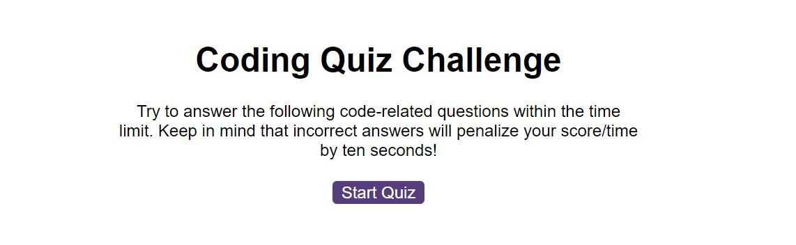

# Js-web-api-quiz

## Description

A multiple question quiz that can be played in the browser. Build using HTML, CSS and Javascript.
The game saves highscores to local storage, and penalises the users score for incorrect answers.

The application has:

* A start button that when clicked a timer starts and the first question appears.
 
  * Questions contain buttons for each answer.
  * 
  * When answer is clicked, the next question appears
  * 
  * If the answer clicked was incorrect then subtract time from the clock

* The quiz should end when all questions are answered or the timer reaches 0.

  * When the game ends, it will display their score and give the user the ability to save their initials and their score

## Installation

N/A

## Usage

View the completed project below on the deployed link. A screenshot has also been added.

 
  

   

[Link to the finished deployed website](https://gavinaldred.github.io/Js-web-api-quiz/)

## Credits

N/A

## License

Please refer to the LICENSE in the repo.

---

## Badges
